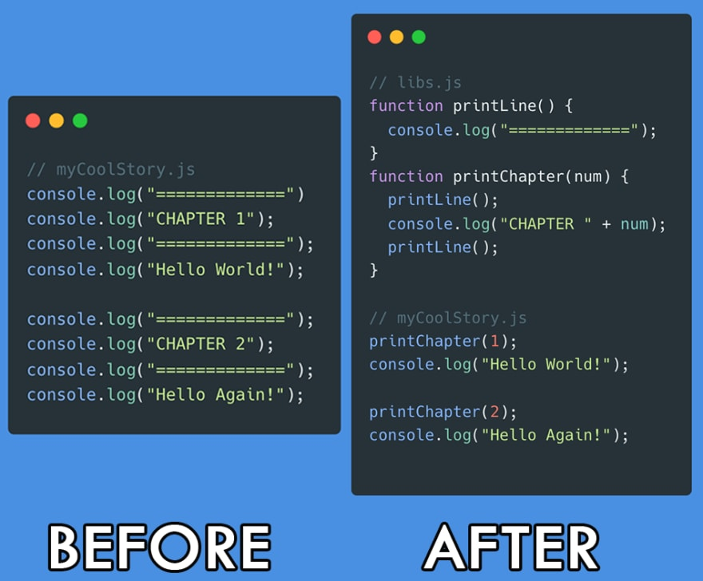
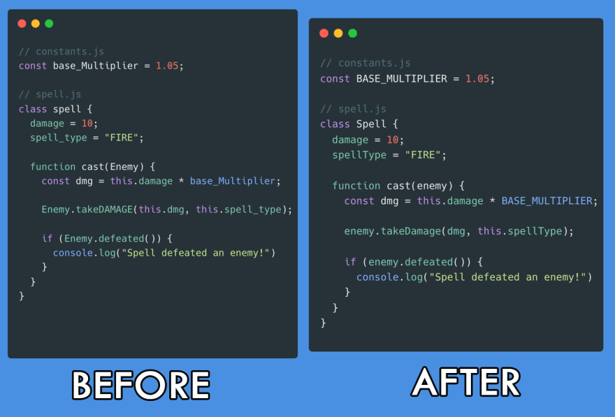
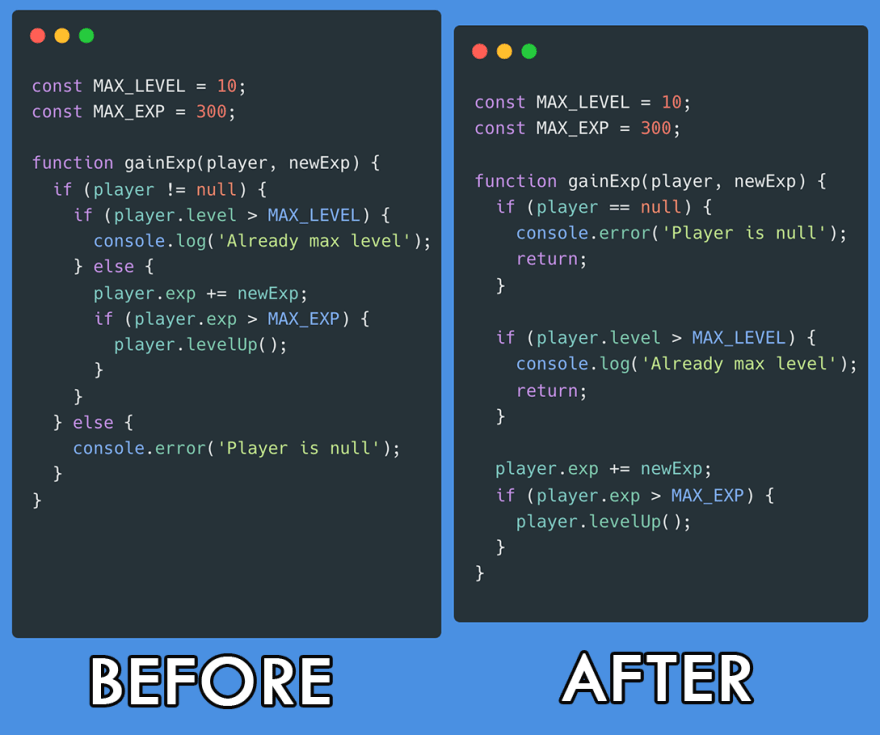
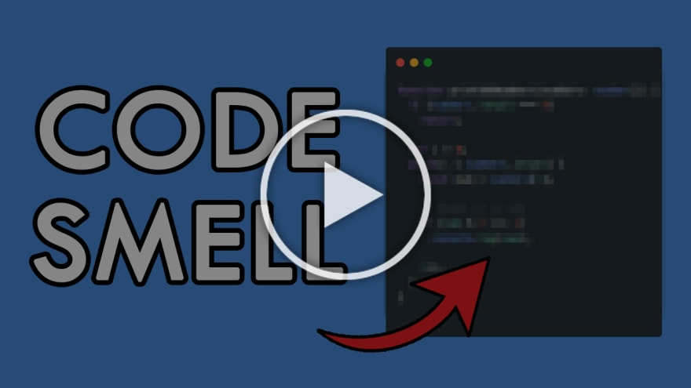

## What is a Code Smell?

Let me provide you with my personal definition and some examples to get a better picture of what we’re talking about.

If you search for Code Smell online you’ll find a dozen different definitions and categorizations, that’s why I’ll do what every javascript developer would do, _create my own framework_. I mean, giving my own definition.

So, here it is: A Code Smell is that feeling after a first glance at a piece of code that immediately makes you think there’s something wrong. You might not have a better solution yet, but the more you look at a chunk of code, the more you think it’s just not right.

_You can find a [video version of this article](https://youtu.be/RFqRfppOlf4) on YouTube. There's also a terrible gag in the intro if you're curious... just saying._

## Some history

This term was initially introduced by Kent Beck in the 90s but it is now quite common and used across all languages.

One of the reasons why it’s hard to get a universal definition is because code smells can vary depending on the language and on the context. There can’t be a standard list that applies everywhere with the same exact relevance, but, I will put the spotlight on some of the most common ones. Right after this video you can start inspecting your projects to see if you find any code smell.

## 1) Duplicate Code

I think the most common is duplicate code. You can smell this when you find yourself copy-pasting a couple lines of code here and there.

I’m not saying it’s forbidden to copy paste, but when you do it please think about it twice. Do you have a better way of organizing the code to avoid this copy pasting? For example you can put the code in a function that you can call where you need it.

I know, the solution is not always that easy but you better do that extra reasoning to avoid repeating code when unnecessary.

---

## 2) Breaking naming conventions

Another real common code smell is on naming conventions. Friendly reminder, you’re not paying for using extra characters in variable names. You don’t need to use super long names, but also not cryptic ones.

When someone reads your code, it has to be straightforward to understand what a variable is, so avoid when possible names with less than 3 or 4 characters. Using i for the index is fine, but if you need to store an account, don’t call it a, just use the word account.

Also, if there are conventions on the casing, make sure to use the right one. Those are highly dependant on the language, but you can search online and there are dozen of styleguides. Pick one and follow it consistently.

---

## 3) Nested if-else

The third smell you can easily notice is when you have too many nested if-else statements. In some cases you find yourself adding some null checks or conditions where in the else branch you just log a message and return.

There’s nothing wrong by itself, but take this example. Ok it’s quite short so you can easily find what is going on, but look what happens if you return early. Isn’t the code much cleaner?

This is a little example, but when you find yourself nesting code on the third or fourth level, think about it, you might get rid of a couple nesting by just returning in the first few lines. This will make the code way easier to read and maintain.

---

## Code Smell Challenge

Spotting code smells requires a little bit of experience and practice, so that you find them at a first glance! You just look at a few lines of code and automatically get that feeling that something is wrong. I described two of them, but there are dozen of code smells you better be aware of.

If you want to train this skill, feel free to [subscribe to my YouTube channel](https://www.youtube.com/channel/UC-KqnO3ez7vF-kyIQ_22rdA?sub_confirmation=1). Once a week I share a code smell minigame just like this one:



---

What do you think? I created a playlist of minigames or challenges just like this one. If you enjoyed it, you can find the playlist by [clicking here](https://youtube.com/playlist?list=PLOQjd5dsGSxKcEVtnt1EIAPj6Z0PvPv-f).

Guess what, the playlist is called “**Can you spot the code smell?**”

