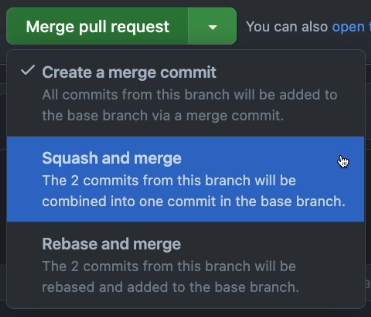
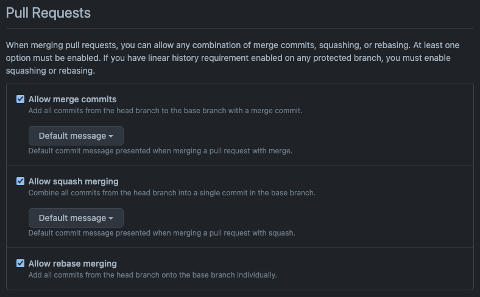

When Merging a Pull Request on GitHub, you mainly have three options, with a merge commit, squash or rebase.

Is there anything wrong in always doing a merge commit? Well, there isn’t right or wrong here, but considering the other strategies might will likely bring you some benefits. Let me tell you why.



_In the video I will go in detail about the three strategies, and I will also do a "live demo" with GitHub stickers and JS pins, if you're curious I'd recommend you to watch the video, otherwise you can find the full text content here below._

---

### Merge Commit

Merge commit is probably the most common as it’s the default option on GitHub and also the default behaviour when you manually use `git merge`.

The history of all your commits remains untouched and on the main branch you see an additional commit that merges all your branch content.

The biggest advantage is that you can easily track down the exact commit where a line has been modified, as long as there aren’t too many commits.

The downside is that when multiple commits are on multiple branches, the history quickly become really tangled and following the path of a change can be quite a challenge.

### Squash merge

The question is, do you really need to keep track of every single commit? Including typos, missing files, formatting… if the answer is no, then you should consider Squash merge.

When squashing a merge, the result is that you get rid of all commits on the branch and only add a single commit on main with all the content.

As a result, the history is much cleaner and while working on a branch you can do all the commits you want, since you know that with the squash all your sins will be forgotten. Kind of.

Who doesn’t like squash merge, usually brings the fact that you’re losing a lot of commit history, but it’s up to you if you think commits on a branch are valuable when reviewing old activity or rather is just noise.

### Rebase

A third way is that you don’t really need a commit that indicates a merge took place, and you still want to end up having all commits in a single, straight line.

Merge commit has all tangled lines plus an extra commit, Squash is a straight line but loses the history so here comes Rebase, which keeps the history AND the straight line AND doesn’t require an extra commit for the merge.

Does this make Rebase the best strategy ever? Well... actually not necessarily, because it has some potentially destructive side effects.

If you get a merge conflict during a rebase, it’s fairly easy to unintentionally lose parts of your code code and if you need to catch up multiple commits you might end up resolving a merge conflict for each single commit, rather than just one in the other merge strategies.

### My two cents

After this overview, what do you think? Let me know in the comments!

In my opinion, if branches don’t stay open for a long time, squash merge is a good option, also I’m not a fan of rebase because it’s too easy to make huge mistakes. But before deciding which strategy to apply you should take some considerations.

For example, how often you and your team have to look back at old commits? How many members are in the team? Does your CI need the full commit history?

Think about it, talk with your team, and you can find together the best strategy for your own usecase.

Actually, a good strategy could be [subscribing to my YouTube channel](https://www.youtube.com/channel/UC-KqnO3ez7vF-kyIQ_22rdA?sub_confirmation=1) if you like my content!

### Config

If you want to enforce only some merge strategies on GitHub, head over the settings of your repository and scroll down a little bit.

Here you will find three sections to allow merge commit, squash or rebase in your pull requests.

If you keep only one selected, all PRs in your repo will be merged with that specific strategy.

For the first two, you can also define the default commit message that can take information from the PR or the commits in the branch in case of a squash.

As you can see rebase doesn’t have this option and the reason is simple. As we just seen, rebasing does not create an extra commit for the merge, so there is nothing to do here. The existing commits are simply moved to the head of your branch.

Since you’re already in this page, if you scroll down a little bit more you might also want to check this flag to automatically delete branches after a PR is merged.

### Closing

If you have any preference or you want to share your experience, please leave a comment, I'll be really happy to hear from you!

But didn’t we just forget about something important? Like… what happens if the two branches have a conflict? Let me show you how Visual Studio Code can help you resolve the conflict, so that you can merge with your desired strategy.

Hit like ❤️ if you liked this article and have a look here: [Resolving Merge Conflicts with Visual Studio Code](/merge-conflict-vscode)
